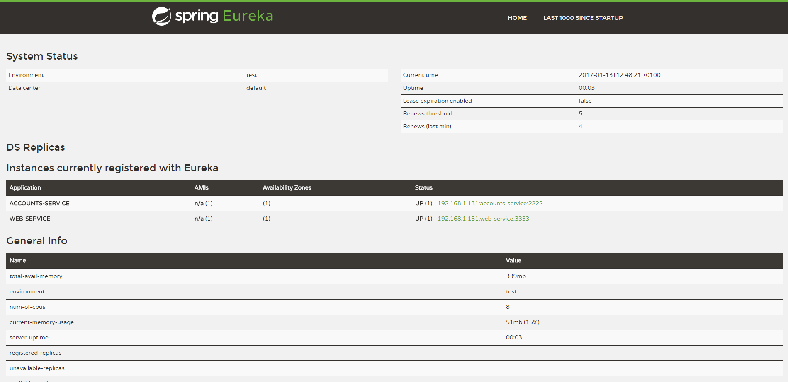

#Account service:

#Web service:

#The service registration service has the two microservices registered:

#A second account microservice is running in the port 4444 and it is registered:

#A brief report describing what happens when you kill the microservice with port 2222. Can the web service provide information about the accounts? Why?
When the Account server in port 2222 is killed and the Web server tries to provide information about the accounts, as its imposible to privide that information it returns a Connection Refused error.
Then it asks the register service in order to obtain a working accounts service, and it responds with the service of port 4444.